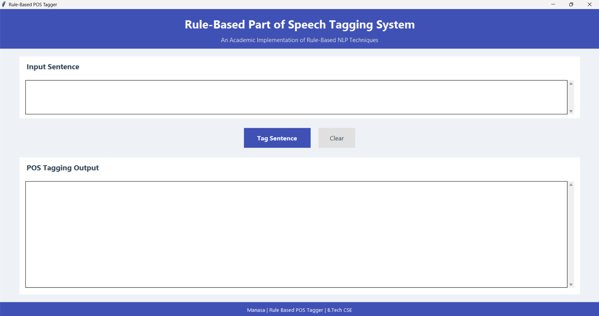
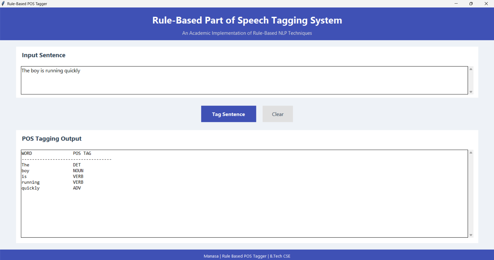

# 🏷️ Rule-Based NLP POS Tagger
A desktop-based **Rule-Based Part-of-Speech (POS) Tagging System** developed using **Python** and **Tkinter**. This project demonstrates fundamental Natural Language Processing (NLP) techniques by assigning grammatical tags to words using lexical dictionaries, morphological analysis, and contextual rules without relying on machine learning models.

## 📖 Overview

Part-of-Speech (POS) Tagging is a core NLP task that identifies the grammatical role of each word in a sentence, such as **Noun, Verb, Adjective, Adverb**, etc.
This project implements a **Rule-Based POS Tagger** that combines:
* Lexicon-Based Tagging
* Morphological Analysis
* Contextual Rule Processing
* Proper Noun Recognition
* Interactive Graphical User Interface (GUI)

## ✨ Features

Lexicon-based POS tagging for known words

Morphological rule handling using suffix patterns

Contextual rule application for unknown words

Proper noun identification

User-friendly Tkinter GUI

Fast and lightweight implementation

Educational demonstration of core NLP concepts


## 🛠️ Technologies Used

| Technology          | Purpose                   |
| ------------------- | ------------------------- |
| Python              | Core Programming Language |
| Tkinter             | Graphical User Interface  |
| JSON                | Rule Storage              |
| CSV                 | Lexicon Storage           |
| Regular Expressions | Tokenization              |

---

## 🏗️ Project Architecture

```text
User Input
     │
     ▼
 Tokenization
     │
     ▼
 Lexicon-Based Tagging
     │
     ▼
 Morphological Rules
     │
     ▼
 Proper Noun Detection
     │
     ▼
 Contextual Rules
     │
     ▼
 Final POS Tags
     │
     ▼
 GUI Output
```

## 📂 Project Structure

```text
Rule-Based-POS-Tagger/
│
├── main.py
├── lexicon.csv
├── morph_rules.json
├── context_rules.json
├── NLP_Documentation.pdf
├── README.md
└── screenshots/
```

## 🚀 Getting Started

### Prerequisites

* Python 3.x

### Installation

```bash
git clone https://github.com/yourusername/rule-based-pos-tagger.git

cd rule-based-pos-tagger

python main.py
```

## 💡 Sample Execution

### Input

```text
The boy is running quickly
```

### Output

```text
WORD                 POS TAG
-----------------------------------
The                  DET
boy                  NOUN
is                   VERB
running              VERB
quickly              ADV
```

---

## 🔍 Key NLP Techniques Implemented

### Lexicon-Based Tagging

Assigns POS tags using a predefined dictionary of words.

### Morphological Analysis

Uses suffix-based rules such as:

```text
-ing  → VERB
-ed   → VERB
-ly   → ADV
-tion → NOUN
```

### Contextual Analysis

Uses neighboring word tags to infer the most likely POS category.

### Proper Noun Detection

Identifies unknown capitalized words as proper nouns.

## 📸 Application Preview

### Home Screen



### POS Tagging Output



---

## 🎯 Learning Outcomes

* Understanding of POS Tagging
* Rule-Based NLP Implementation
* Text Processing using Python
* GUI Development with Tkinter
* Working with JSON and CSV datasets
* Application of Linguistic Rules in NLP

---

## 🔮 Future Enhancements

* Support for larger lexicons
* Additional contextual rules
* Hybrid Rule-Based + Machine Learning approach
* Export results to CSV/PDF
* Performance evaluation metrics

---

## 👩‍💻 Author

**Manasa**

B.Tech Computer Science & Engineering

Passionate about NLP, Machine Learning, and Software Development.

---

## ⭐ Support

If you found this project useful, consider giving it a ⭐ on GitHub.
